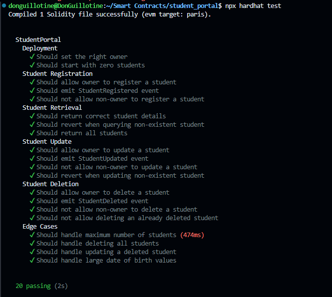

# StudentPortal Smart Contract
The StudentPortal is a Solidity smart contract designed to manage student records on the Ethereum blockchain. It provides functionality for registering, updating, and deleting student information, as well as retrieving individual and collective student data.

## Features

- Register new students with detailed information
- Update existing student records
- Delete student records
- Retrieve individual student details
- Get the total count of registered students
- Fetch all registered students' information
- Ownership control for administrative functions

## Contract Details

- Solidity Version: ^0.8.24
- License: MIT

## Data Structure

The contract uses a `Student` struct to store the following information for each student:

- Name
- Email
- Date of Birth
- Local Government Area
- Country
- State

## Main Functions

### 1. registerStudent

Allows the contract owner to register a new student.

```solidity
function registerStudent(
    string memory _name,
    string memory _email,
    uint256 _dateOfBirth,
    string memory _localGovernmentArea,
    string memory _country,
    string memory _state
) external onlyOwner
```

### 2. updateStudent

Enables the contract owner to update an existing student's information.

```solidity
function updateStudent(
    uint256 _studentId,
    string memory _name,
    string memory _email,
    uint256 _dateOfBirth,
    string memory _localGovernmentArea,
    string memory _country,
    string memory _state
) external onlyOwner
```

### 3. deleteStudent

Allows the contract owner to delete a student record.

```solidity
function deleteStudent(uint256 _studentId) external onlyOwner
```

### 4. getStudent

Retrieves the information of a specific student.

```solidity
function getStudent(uint256 _studentId) external view returns (Student memory)
```

### 5. getStudentCount

Returns the total number of registered students.

```solidity
function getStudentCount() external view returns (uint256)
```

### 6. getAllStudents

Fetches information of all registered students.

```solidity
function getAllStudents() external view returns (Student[] memory)
```

## Events

The contract emits the following events:

- `StudentRegistered(uint256 indexed studentId)`
- `StudentUpdated(uint256 indexed studentId)`
- `StudentDeleted(uint256 indexed studentId)`

## Access Control

The contract implements an `onlyOwner` modifier to restrict access to administrative functions (register, update, delete) to the contract owner only.

## Deployment

To deploy the StudentPortal contract:

1. Ensure you have a development environment set up with Hardhat and Ethers.js.
2. Create a deployment script (e.g., `deploy-student-portal.js`) in your `scripts` folder.
3. Run the deployment script using Hardhat:

   ```
   npx hardhat run scripts/deploy-student-portal.js --network lisk-sepolia
   ```

4. Save the deployed contract address for future interactions.

## Security Considerations

- Only the contract owner can perform administrative actions.
- The contract stores data on-chain, which may not be suitable for sensitive information in a production environment.
- Consider implementing additional access controls or encryption for sensitive data.
- Thoroughly test the contract before deploying to a live network.

# All Tests Passed



## Future Improvements

- Implement pagination for `getAllStudents` to handle large numbers of records efficiently.
- Add events for important state changes.
- Consider implementing a multi-sig wallet for owner actions.
- Explore off-chain storage solutions for scalability and privacy.

## License

This project is licensed under the MIT License. See the LICENSE file for details.
